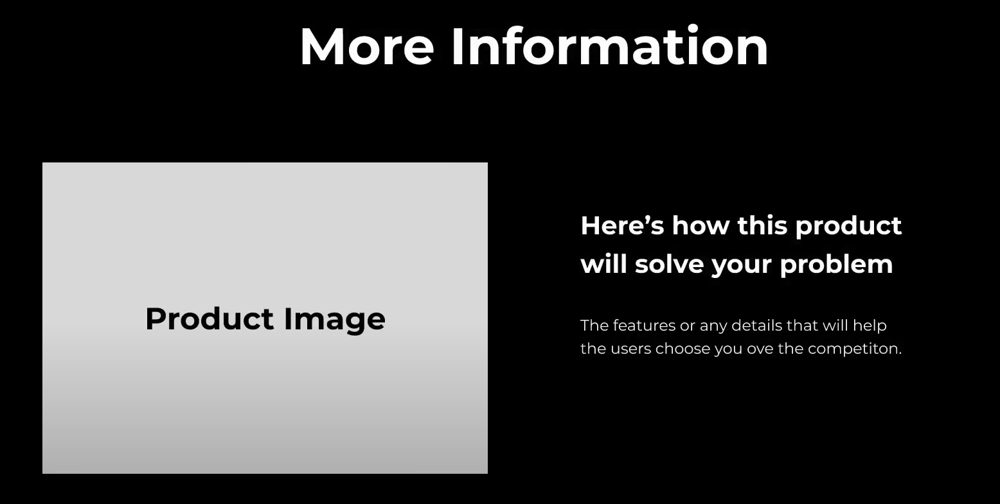

## Begginer Mistakes

- Bad Design
- No Planning
- No Research
- Wrong Colors and Fonts
- Hollow Content
- No empathy for the users
- No Business Understanding

# The Problem

Those mistakes lead us to a bad functioning website or application. We don't like how the end result looks or how it works. Some pages load after a extremely long time, etc. The clients keeps making revisions after revisions

# The Solution

Two things:

1. Design First. Figure out who the audience is and what problem this website will
   solve for them.

   <ul>
     <li>Now we are thinking in terms of what the user wants.</li>
     <li>
       Design also includes content. Once we have what the audience needs, we
       will be able to create the right structure from the beginning.
     </li>
   </ul>

2. Coding. We must implement the design we first imagined.

# Tips and Tricks

- Build sites using Repeating Design. Create components you can copy and paste multiple times.
- Divide the page in sections. So that you can focus on different parts at each time.
- the Hero section is one of the most important parts.

## The Hero Section

- Here you must make clear what your solution is for the user's problem.
- Also, need a call to action.
  

### Hero Design

- The first: Two columns (easier for mobile)
- One column (A big shot of an image that can adapt for multiple devices)
- Always take care of the responsiveness.
- One your Hero Section is done, you will have gained the user's atention, now let's go for his trust.
- For doing this, explain further your solution to their problem.
  
  

# Fonts and Colors

Use accent colors and a homogeneus palette.
One font per website.

Remember you can use css variables for setting up the global colors. Like this:

Using shadcnui theme tools is a great example of this.
The neat thing is that you can change the values later and the result will apply for all the website.

# Final Tricks

- Dynamic Heading Size: Use max-w for headings.
- Flexible cards: flex wrap and min width
- SVG Icons: For an interactive experience. (As it is a rendered pixel, you can change its color, different from a static png).
- Scroll snap. When you scroll down, let each time a snap for staying at just the right position.
- Scale up and down buttons: Btn:Hover -> Scale up: scale: 1.05.

---

  Original ideas from:
  <a
    className="no-underline hover:underline "
    target="_blank"
    href="https://youtu.be/OjEg0IBR_ak"
  >
    &commat;whosajid
  </a>

